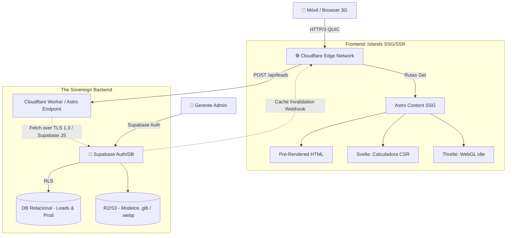

# Architecture Document

**Sistema:** Plataforma Integral de Generación de Demanda - Templados AL13  
**Versión:** 1.0 (Topología Edge-Sovereign)  
**Fecha:** Febrero 2026  
**ESTADO DID:** `[DID_CERTIFIED]`  
**Agente Compilador:** The Architect-Scribe V2.0  

## 1. Patrón Arquitectónico y Filosofía (Architectural Style)

El ecosistema repudia el antiguo patrón de Monolito Servidor (Node.js/PHP persistente) y las Single Page Applications (SPAs) puras. Se implementa un **Patrón Híbrido Bifurcado**:
*   **Edge-Native Islands Architecture (Frontend):** Las interfaces públicas se destilan en HTML pre-compilado en el límite de la red (Edge Nodes CDN) mediante **Astro**. La reactividad ocurre *solo* en micro-aplicaciones encapsuladas ("Islas") construidas con **Svelte**.
*   **BaaS Soberano Estricto (Backend-as-a-Service):** Un cluster de base de datos **Supabase (PostgreSQL)** autohosteado o gestionado, restringido por Row Level Security (RLS) para autenticación del Administrador (Dueño AL13) y la ingesta atómica de Leads B2B (Data Sovereignty).

![Topología Conceptual (Mermaid Fallback)]

## 2. Descripción de Subsistemas Activos (System Components)

### 2.1 Subsistema Frontend (El Motor Periférico PWA)
*   **Orquestador (Astro Router) y PWA Layer:** Enruta entre `<pages>` estáticas. Delega la intercepción de anclas (`<a>`) a la **View Transitions API** embebida logrando comportamiento similar a un App Shell. Incluye integración **PWA** (`@vite-pwa/astro` y Workbox) para habilitar instalación nativa en móviles (bypassing App Stores) y Service Workers para caché offline estricto de assets críticos. Integrado con **Tailwind CSS** para un sistema de diseño estático de costo cero en *runtime*.
*   **Motor CSR de Cálculo (B2B Quoter - Svelte):** Componente aislado de **Svelte**. **Responsabilidad:** Manejar estados transientes complejos con reactividad ultra-rápida (tolerancias, pesos del vidrio, anchos) en la memoria local y aplicar heurísticas de limitantes físicos (Zod Validators). Svelte previene el peso de Virtual DOMs (React).
*   **Motor CSR de Representación WebGL (B2C Viewer - Threlte):** Encapsulamiento del loop de eventos de *Three.js* mediante **Threlte**. **Responsabilidad:** Instanciación declarativa y reactiva del Canvas 3D. El motor (Threlte) maneja de forma segura la destrucción del contexto de Memoria WebGL para prevenir Memory Leaks móviles (Out-of-Memory).

### 2.2 Subsistema Backend (El Refugio Soberano)
*   **Endpoints de Gateway (Serverless API / Cloudflare Workers):** Funciones en aislamiento V8 en el Edge. Actúan como porteros o bouncers de red; su meta es recibir el Payload del usuario, verificar con *Zod* que no tenga malformaciones, y derivarlo a Supabase. **Responsabilidad:** Cortafuego estricto (Rate Limiting y Sanitización L7).
*   **Base de Datos Relacional (`Supabase/PostgreSQL`):** El "Single Source of Truth" (SSOT). Define el esquema transaccional cerrado bajo políticas estrictas de **Row Level Security (RLS)**. El Gateway o los clientes autorizados inyectan/leen data directamente si el RLS lo permite.
*   **Almacenamiento Perimetral de Objetos (Supabase Storage / R2):** Almacén compatible con S3 donde se depositan los polígonos 3D (hasta 15MB) y galerías dinámicas auto-optimizadas (.AVIF, .WEBP) sin ensuciar la base de datos central.

## 3. Flujos de Datos Transaccionales (Data Flows)

### 3.1 Flujo B2B (Inyección de Cotización Ciega)
1.  **Actor:** Contratista. Ingresa dimensiones (Ancho 3m, Altura 2m).
2.  **Isla Quoter (Svelte):** Aplica reglas de negocio en caché local (`If Ancho > 2m Then Requiere_Refuerzo`). Informa ok.
3.  **Captura PII:** Solicita Email y Teléfono. Dispara `POST /api/leads`.
4.  **Edge Worker / Astro Endpoint:** Sanitiza JSON con Zod. Enruta la petición a Supabase usando el rol de servicio `service_role` o un esquema anónimo con RLS permisivo de inserción ciego.
5.  **Supabase RLS:** Verifica la legitimidad de la inserción. Un Trigger/Edge Function en Supabase o el propio intermediario dispara el webhook para enviar un correo (ej. Resend / SMTP).
6.  **Respuesta Táctica:** Retorna `HTTP 201 Created` al Edge Worker. El Worker inyecta respuesta en la Isla Svelte (CSR).

### 3.2 Flujo Administrador (CMS On-Demand Build)
1.  **Actor:** Gerente. Sube proyecto `Casa Quinta` al CMS (Dashboard `/admin`).
2.  **Transcodificador:** El servidor procesa el JPG -> WEBP. Almacena en S3 Bucket.
3.  **Mutación BD:** Inserta metadata (`URL_Imagen`, `Fecha`, `Materiales`).
4.  **El Efecto Dominó (Revalidation Trigger):** El Backend dispara un webhook cURL al sistema de compilación de Astro en Cloudflare.
5.  **SSG Parcial:** La CDN compila *solamente* estáticamente la nueva ficha descriptiva (HTML caching) inyectándola a los nodos mundiales. Cero caídas de servicio.

## 4. Estrategia de Escalabilidad y Alta Disponibilidad (HA)

La asimetría del Frontend estático significa una invulnerabilidad total contra avalanchas (Slashdot effect).
*   **Fronend (Indestructible):** Al desplegar mediante Cloudflare Pages CDN edge nodes, la plataforma es inherentemente resistente a cientos de miles de solicitudes concurrentes estáticas. Si la BD trasera muere temporalmente, el catálogo público sigue visualizándose a nivel caché.
*   **Backend (Confinado):** Como los visitantes normales *no* hacen request a la BD (solo SSG read) y los únicos que postean son la minoria de cotizantes B2B (Leads), y el gerente, la carga de la Base de Datos Relacional es despreciablemente baja en TPS (Transacciones por Segundo). Permitiendo usar una instancia relacional t3.micro o Base "Supabase" ultra-barata con disponibilidad de 99.9% nativo.

## 5. Tolerancia a Fallas en Fronteras de Red (Failover Edge Cases)

Para mitigar los Micro-Cortes de señal en terrenos remotos de La Guajira:
*   **Corte en Hidratación JavaScript (The 3G Drop):** Si el navegador descarga el HTML pero la red 3G titubea perdiendo el chunk de Svelte de la calculadora, el usuario no verá un botón averiado. CSS inyectado estáticamente (`:not(:defined)`) mantendrá el botón opaco o en estado *disabled* y con texto "Cargando Motor..." hasta que el archivo cruce la red y la *Isla* asuma control local.
*   **Muerte de Motor WebGL (iOS OOM):** Si el contexto de memoria RAM se ahoga emulando los reflejos PBR del Aluminio y aborta, se levanta el evento `webglcontextlost`. Los wrappers nativos (como **Threlte**) manejan de forma segura la destrucción, y un fallback a ` fade-in` puede revelar un Render 2D en JPG del modelo con un `toast` notificando sobre la eficiencia térmica.

---
*Fin Documento de Arquitectura. El sistema prescinde de la fragilidad del renderizado dependiente del servidor (Node SPA) en el Front, anclando toda seguridad y peso cognitivo transaccional en el refugio inviolable de la Base de datos AL13 Core.*
