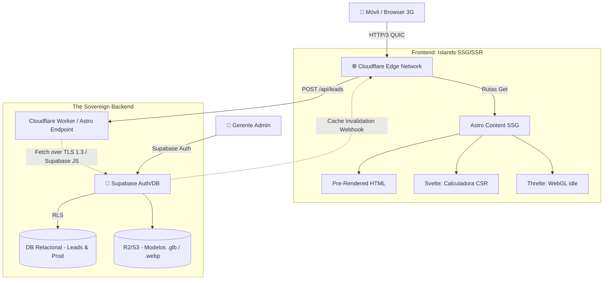

# Architecture Document

**Sistema:** Plataforma Integral de Generación de Demanda - Templados AL13  
**Versión:** 2.0 (Topología Edge-Sovereign — SOLID & DI Update)  
**Fecha:** Febrero 2026  

**Agente Compilador:** The Architect-Scribe V2.0  

## 1. Patrón Arquitectónico y Filosofía (Architectural Style)

El ecosistema repudia el antiguo patrón de Monolito Servidor (Node.js/PHP persistente) y las Single Page Applications (SPAs) puras. Se implementa un **Patrón Híbrido Bifurcado**:
*   **Edge-Native Islands Architecture (Frontend):** Las interfaces públicas se destilan en HTML pre-compilado en el límite de la red (Edge Nodes CDN) mediante **Astro**. La reactividad ocurre *solo* en micro-aplicaciones encapsuladas ("Islas") construidas con **Svelte**.
*   **BaaS Soberano Estricto (Backend-as-a-Service):** Un cluster de base de datos **Supabase (PostgreSQL)** autohosteado o gestionado, restringido por Row Level Security (RLS) para autenticación del Administrador (Dueño AL13) y la ingesta atómica de Leads B2B (Data Sovereignty).

![Topología Conceptual (Mermaid Fallback)]

## 2. Descripción de Subsistemas Activos (System Components)

### 2.1 Subsistema Frontend (El Motor Periférico PWA)
*   **Orquestador (Astro Router) y PWA Layer:** Enruta entre `<pages>` estáticas. Delega la intercepción de anclas (`<a>`) a la **View Transitions API** embebida logrando comportamiento similar a un App Shell. Incluye integración **PWA** (`@vite-pwa/astro` y Workbox) para habilitar instalación nativa en móviles (bypassing App Stores) y Service Workers para caché offline estricto de assets críticos. Integrado con **Tailwind CSS** para un sistema de diseño estático de costo cero en *runtime*.
*   **Motor CSR de Cálculo (B2B Quoter - Svelte):** Componente aislado de **Svelte**. **Responsabilidad:** Manejar estados transientes complejos con reactividad ultra-rápida (tolerancias, pesos del vidrio, anchos) en la memoria local y aplicar heurísticas de limitantes físicos (Zod Validators). Svelte previene el peso de Virtual DOMs (React).
*   **Motor CSR de Representación WebGL (B2C Viewer - Threlte):** Encapsulamiento del loop de eventos de *Three.js* mediante **Threlte**. **Responsabilidad:** Instanciación declarativa y reactiva del Canvas 3D. El motor (Threlte) maneja de forma segura la destrucción del contexto de Memoria WebGL para prevenir Memory Leaks móviles (Out-of-Memory).

#### 2.1.1 Ecosistema Políglota de Lenguajes (Islands Stack)
El proyecto rechaza los monolitos de un solo framework en favor de un ensamblaje políglota hiper-optimizado ("The Best Tool for the Job"):
1.  **Astro (`.astro`):** El Orquestador. Usado exclusivamente para maquetar el esqueleto HTML estático y enrutamiento veloz. Entrega cero JavaScript por defecto al cliente, maximizando SEO y LCP.
2.  **Svelte 5 (`.svelte`):** Las Islas Reactivas. Se incrusta solo donde se necesita interactividad (CTAs, calculadoras, menú móvil). Svelte compila a Vanilla JS eliminando el "Virtual DOM", resultando en animaciones fluidas y paquetes binarios diminutos.
3.  **TypeScript (`.ts` / `lang="ts"`):** La Lógica de Negocio. Usado obligatoriamente para endpoints de API (`leads.ts`), motores de cálculo (`physicsEngine.ts`) y estado complejo dentro de los componentes Svelte. Provee seguridad de tipos inquebrantable (Type-Safety) evitando bugs en capa de validación geométrica/Zod y bases de datos.
4.  **JavaScript Vainilla (`.js` / `.mjs`):** La Pegajosidad de Configuración. Usado de forma estricta solo para los archivos de configuración en la raíz del proyecto (`astro.config.mjs`, `tailwind.config.mjs`). Esto previene el problema del "huevo y la gallina" (ej. una herramienta que compila TypeScript no puede requerir un archivo TypeScript para inicializarse).

### 2.2 Subsistema Backend (El Refugio Soberano)
*   **Endpoints de Gateway (Serverless API / Cloudflare Workers):** Funciones en aislamiento V8 en el Edge. Actúan como porteros o bouncers de red; su meta es recibir el Payload del usuario, verificar con *Zod* que no tenga malformaciones, y derivarlo a Supabase. **Responsabilidad:** Cortafuego estricto (Rate Limiting y Sanitización L7).
*   **Base de Datos Relacional (`Supabase/PostgreSQL`):** El "Single Source of Truth" (SSOT). Define el esquema transaccional cerrado bajo políticas estrictas de **Row Level Security (RLS)**. El Gateway o los clientes autorizados inyectan/leen data directamente si el RLS lo permite.
*   **Almacenamiento Perimetral de Objetos (Supabase Storage / R2):** Almacén compatible con S3 donde se depositan los polígonos 3D (hasta 15MB) y galerías dinámicas auto-optimizadas (.AVIF, .WEBP) sin ensuciar la base de datos central.

## 3. Flujos de Datos Transaccionales (Data Flows)

### 3.1 Flujo B2B / B2C (Captura Automática de Leads)
1.  **Actor:** Contratista (B2B) o Consumidor Final (B2C). Ingresa dimensiones (Ancho 3m, Altura 2m).
2.  **Isla Quoter (Svelte):** Aplica heurísticas del Motor Físico en memoria local (`If Ancho > 2m Then Requiere_Refuerzo`). El sistema asombra al cliente con parámetros técnicos en tiempo real.
3.  **Captura PII:** Solicita Nombre y Teléfono. Dispara `POST /api/leads`.
4.  **Edge Worker / Astro Endpoint:** Sanitiza JSON con Zod. Enruta la petición a Supabase previniendo inyecciones de código.
5.  **Notificación Transaccional Asíncrona:** Inmediatamente después de insertar en BD, el endpoint dispara un evento `Fire-and-Forget` hacia el SDK de **Resend**. 
    *   **Decisión Arquitectónica (FinOps):** Seleccionamos Resend por su capa gratuita de 3,000 correos/mes. Esto absorbe holgadamente la tracción B2B inicial y el escalado medio B2C a costo $0. Si el volumen B2C explota mediáticamente, la migración a AWS SES (o el upgrade al plan Pro de $20/mes) es trivial ya que la lógica está aislada en el backend `api/leads.ts` sin acoplar el frontend.
6.  **Respuesta Táctica:** Retorna `HTTP 201 Created` al cliente de Svelte, mostrando mensaje de éxito sin obligar al usuario a esperar que el correo de notificación se envíe.

### 3.2 Flujo Administrador (CMS On-Demand Build)
1.  **Actor:** Gerente. Sube proyecto `Casa Quinta` al CMS (Dashboard `/admin`).
2.  **Transcodificador:** El servidor procesa el JPG -> WEBP. Almacena en S3 Bucket.
3.  **Mutación BD:** Inserta metadata (`URL_Imagen`, `Fecha`, `Materiales`).
4.  **El Efecto Dominó (Revalidation Trigger):** El Backend dispara un webhook cURL al sistema de compilación de Astro en Cloudflare.
5.  **SSG Parcial:** La CDN compila *solamente* estáticamente la nueva ficha descriptiva (HTML caching) inyectándola a los nodos mundiales. Cero caídas de servicio.

## 4. Estrategia de Escalabilidad y Alta Disponibilidad (HA)

La asimetría del Frontend estático significa una invulnerabilidad total contra avalanchas (Slashdot effect).
*   **Fronend (Indestructible):** El código de AL13 no se organiza por "Tipos de Archivos" arcaicos (e.g. `controllers/`, `views/`, `models/`), sino bajo la estricta **Hexagonal-Sovereign Architecture (HSA)**. La carpeta `src/` opera como un búnker estructurado en **4 Dominios Absolutos**:
*   📁 **`core/`**: El núcleo soberano, subdividido en capas internas:
    *   `core/config/` — Variables de entorno centralizadas con validación Zod fail-fast (`env.ts`).
    *   `core/domain/` — Lógica de negocio **pura** (cero dependencias de framework): schemas Zod (`leadSchema.ts`), motor físico (`physicsEngine.ts`), interfaces abstractas (`repositories/ILeadRepository.ts`, `services/IEmailService.ts`), y estrategias por producto (`strategies/CabinaDuchaStrategy.ts`, etc.).
    *   `core/infrastructure/` — Adaptadores concretos que implementan las interfaces del dominio: `repositories/SupabaseLeadRepository.ts`, `services/ResendEmailService.ts`. **ÚNICO** lugar donde viven SDKs externos (Supabase, Resend).
    *   `core/theme/` — Sistema de diseño CSS (`global.css`).
    *   `core/types/` — Tipos generados por Supabase CLI (`database.types.ts`).
*   📁 **`shared/`**: Componentes visuales y lógicos universales (Ej: Layout maestro, Botones base, BadgeUI).
*   📁 **`modules/`**: Los islotes de negocio aislados (Feature Sliced Design). Cada módulo tiene `index.ts` (Barrel File público), `ui/` (Svelte, solo presentación) y `api/` (clientes HTTP).
*   📁 **`pages/`**: Las rutas Astro (`index.astro`, `/api/leads.ts`). **Tienen terminantemente prohibido albergar lógica de negocio pura.** Los endpoints solo orquestan: validan con Zod, delegan a Repository/Service, responden HTTP.
*   *Mandato:* Si un agente de IA o desarrollador humano intenta crear una carpeta ajena a estas 4 (ej. `src/utils` o `src/services`), el Pull Request será rechazado.

### Patrones Arquitectónicos Implementados
*   **Dependency Inversion (SOLID 'D'):** Los endpoints (`pages/api/`) dependen de interfaces abstractas (`ILeadRepository`, `IEmailService`), no de SDKs concretos. Permite cambiar de Supabase a MongoDB sin tocar el endpoint.
*   **Strategy Pattern (SOLID 'O'):** El motor físico (`physicsEngine.ts`) despacha la validación a estrategias concretas por `ProductType` via un registry map. Añadir un nuevo producto = crear una nueva clase, sin modificar el código existente.
*   **Fire-and-Forget (Resiliencia):** El envío de email no bloquea la respuesta HTTP. Si Resend cae, el Lead se guarda igual.
*   **Path Aliases Absolutos:** Todo import entre capas usa `@core/*`, `@shared/*`, `@modules/*`. Enforced por ESLint `no-restricted-syntax` como error.
*   **Backend (Confinado):** Como los visitantes normales *no* hacen request a la BD (solo SSG read) y los únicos que postean son la minoria de cotizantes B2B (Leads), y el gerente, la carga de la Base de Datos Relacional es despreciablemente baja en TPS (Transacciones por Segundo). Permitiendo usar una instancia relacional t3.micro o Base "Supabase" ultra-barata con disponibilidad de 99.9% nativo.

## 5. Tolerancia a Fallas en Fronteras de Red (Failover Edge Cases)

Para mitigar los Micro-Cortes de señal en terrenos remotos de La Guajira:
*   **Corte en Hidratación JavaScript (The 3G Drop):** Si el navegador descarga el HTML pero la red 3G titubea perdiendo el chunk de Svelte de la calculadora, el usuario no verá un botón averiado. CSS inyectado estáticamente (`:not(:defined)`) mantendrá el botón opaco o en estado *disabled* y con texto "Cargando Motor..." hasta que el archivo cruce la red y la *Isla* asuma control local.
*   **Muerte de Motor WebGL (iOS OOM):** Si el contexto de memoria RAM se ahoga emulando los reflejos PBR del Aluminio y aborta, se levanta el evento `webglcontextlost`. Los wrappers nativos (como **Threlte**) manejan de forma segura la destrucción, y un fallback a ` fade-in` puede revelar un Render 2D en JPG del modelo con un `toast` notificando sobre la eficiencia térmica.

---
*Fin Documento de Arquitectura. El sistema prescinde de la fragilidad del renderizado dependiente del servidor (Node SPA) en el Front, anclando toda seguridad y peso cognitivo transaccional en el refugio inviolable de la Base de datos AL13 Core.*
